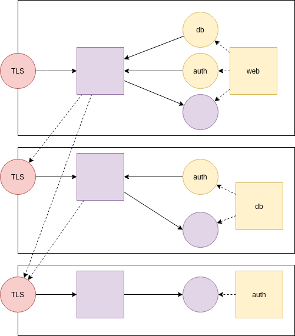

Principia
=========


Principia is a project that aims to simplify the wiring of network programs
into applications.  It tries to follow the example of `ssh` as much as possible,
rather than `kubernetes` or `docker-compose`.  Specifically, it has these goals:

- Reduce config as much as possible.  If config is complex, it can create more problems than it is solving.
- Chose integration over flexibility.  Being opinionated will make it easier to do common tasks that are often possible in theory, but too hard to do in other frameworks.
- X509 certificates are an incredible source of pain for users.  So, we want to handle securing traffic in the mesh; without onerous impositions on the user.
- Single-binary and standalone.  This should be a utility that can be used to stand up a network of services, or to stand up an integration test.  A key thing is to make it easy to avoid port conflicts, so that services don't interfere with each other.
- Do not rely on DNS or rely too heavily on containers.  Talking direct to peer services is what creates a lot of config; because TLS gets pushed onto the app developers and users.  Load balancing considerations get pushed onto users.
- Instead, rely heavily on tunneling; like common `ssh` setups.  In `ssh`, it is easy to spawn a command on a remote machine, and give that command some tunnels to reach some other services.  But `ssh` doesn't do load balancing or discovery.
- Hide load-balancing and discovery and encryption in the tunnels.  Processes only see 127.0.0.1.  They talk only to local ports.
- Rely on a no-install single binary.  Instead of writing XML, Yaml, or Json configs; just require that Go SDK is installed and `go run main.go` on a file.  The library uses structs so that most of it looks like Json, but being a real language, you won't need to resort to tricks in templates.  Go is suitable as a config scripting language for doing dependency-injection and setup.


> Prerequisites: Have docker installed so that it does not need root to run; which is not the default on Linux.  Have Go 1.13 installed, with GOPATH setup correctly.

This example resembles a simple integration test we have in package `edge`, run like this:
```bash
./build
```



> Round circles are TCP ports.  Red is TLS.  Purple is the actual binary with sidecar.  Yellow are spawned processes and tunnel ports.

As an example, every Edge (in purple) has a TLS entry point for entering through the "front door", and a plaintext private entry point for entering through the "back door".  In the back, services think that everything is bound to 127.0.0.1.  The process is an Edge proxy on the front, and a sidecar on the back; to allow the user to maintain the illusion of isolation.

- There is _always_ a TLS port on front of Edge.
- There is _always_ a plaintext port on the back of it, which is the sidecar.
- The sidecar _always_ controls launching binaries inside of it.  That way:
  - It can respond if a process dies.
  - It can alter env vars and parameters.
  - It can ask another edge to perform the actual launch, for location independence.
  - Edges can gossip to keep in touch about who is doing what.
  - Everything except the TLS ports are bound to 127.0.0.1, to avoid a plaintext-service open port nightmare, and to stop people from from pushing X509 support into their services (due to being too hard to set up in the mesh).
  - Since edges do TLS among themselves, something like Spiffe can be implemented without trouble.  Edges only talk to edges, so there is no reason to follow any complex standards.

In the example, we have a web app that has two dependencies.  It can talk to them through reverse proxy when they happen to be http services (purple).  Or if they are non-http databases (ie: Postgres, MySQL, Mongo), then a tunnel port can easily be setup (yellow).  The tunnel reaches other machines _only_ over TLS.  But because there is only one TLS entry point, websockets are used to transport non-http traffic.

> This is probably one of the most important features.  With tunnels, reverse proxies are somewhat redundant in the backend.  Reverse proxies are convenient for creating a single-origin illusion for the Javascript front-end.

Like `ssh`, the daemons are all rather similar.  An Edge just needs enough information to run a TLS server for the Edge.

```go
// This is a sidecar for a database on random port
eDB, err := edge.Start(&edge.Edge{
  CertPath:  certPath,
  KeyPath:   keyPath,
  TrustPath: trustPath,
})
```

> see edge/edge_test.go

Once this edge exists, we can spawn commands in it, very much like `ssh`.  In this example, we are:

- Spawning a process and naming it so that a reverse proxy of `/eDB_eWeb/` can reach it.
- When it runs, it will pick a port for the spawn if we do not specify it.
- The port will be bound to a listener socket.
- We can inject the chosen port into the command-launch with a few methods (environment vars, parameter overwrite, etc)

```go
eDB.Spawn(edge.Listener{
  Name: "eDB_eWeb", // an eDB instance, with a schema for eWeb
  Run: edge.Command{
    EditFn: func(lsn *edge.Listener) {
      // This is how we let our randomly assigned port override the one in the command
      lsn.Run.Cmd[5] = fmt.Sprintf("127.0.0.1:%d:5984", lsn.Port)
    },
    Stdout: ioutil.Discard,
    Stderr: ioutil.Discard,
    Cmd: []string{
      "docker",
      "run",
      "--name", "eDB",
      "-p", "127.0.0.1:5984:5984",
      "-e", "COUCHDB_USER=admin",
      "-e", "COUCHDB_PASSWORD=password",
      "couchdb",
    },
    Dir:       ".",
    HttpCheck: "/",
  },
})
```

Here is an example of injecting the randomly chosen port into an environment variable:

```go
	TryTest(t, eAuth1.Spawn(edge.Listener{
		Name:        "eAuth",
                // When mysvc was spawned, Port was set.  
                // Assign to this env var for mysvc to launch on that port.
                // This is the opposite of how most frameworks do it.
                // The sidecar makes up a port, and launches the command with it injected. 
		PortIntoEnv: "MYSVC_PORT", 
		Run: edge.Command{
			Cmd: []string{"/usr/bin/mysvc"},
		},
	}))
```

> Note HttpCheck.  When the port it spawns on becomes reachable with a GET on this URL, then the spawn returns.  This eliminates the sleep tricks and complex config to do readiness probes that are common in other frameworks.

When this command is running, the Edge and Sidecar will have the same http handling, only differing in the Edge TLS requirement.  This lets processes talk back to their sidecar without any certificate setup.  The sidecars will speak TLS among themselves.

- If multiple Edges Spawn things with the same name, then load-balancing will be done automatically.
- When a spawn dies, it will eventually fall out of the list of Volunteers to handle the load balance.

Another example of a spawn is a static web server.

```go
// Launch a static web server.  We don't need a container for this.
eWeb.Spawn(edge.Listener{
  Name:   "eWeb",
  Expose: true,
  Run: edge.Command{
    Static:    ".",
    HttpCheck: "/",
  },
})
```

This web server will have a dependency on a database.  If the database isn't http, it will need to have a tunnel.

```go
// We point to peers, so that we can make TLS connections to find out what is available
eWeb.Peer(eDB.Host, eDB.Port)
eWeb.Tunnel("eDB_eWeb", eDB_eWeb_port)
```

The tunnel can be found on the other machine, because when we hit the endpoint `GET /available`, we get a data structure that tells us what reverse proxy prefixes (and websockets) are available in the proxy.

> This is not a config file.  It is automatically generated when Edges query each other for `GET /available`.  When processes and edges, die, `/available` will change.  If multiple edges are hosting a service, then it will have multiple volunteers; which is load-balancing.  An Endpoint is a socket that looks like the plain service with no reverse-proxying, and is the actual service if local, or over a TLS websocket if done by a volunteer.  There is no explicit config to use websockets.  These are defaults. 

```json
// https://localhost:8030 /available
{
  "eAuth": {
    "Endpoint": "127.0.0.1:8038",
    "Volunteers": [
      "127.0.0.1:8024",
      "127.0.0.1:8026"
    ]
  },
  "eDB_eWeb": {
    "Endpoint": "127.0.0.1:8037",
    "Volunteers": [
      "127.0.0.1:8022"
    ]
  },
  "eWeb": {
    "Endpoint": "127.0.0.1:8036",
    "Expose": true
  },
  "mongo_eweb": {
    "Endpoint": "127.0.0.1:8039",
    "Volunteers": [
      "127.0.0.1:8028"
    ]
  },
  "sidecarInternal": {
    "Endpoint": "127.0.0.1:8031"
  }
}
```

Clients only care that a named service they need exists. For example:

- /eWeb/index.html to 8030 or 8031 reaches /index.html on 127.0.0.1:8036.  
- If we talk to 8036, there is no need for a proxy prefix, as it is the actual service
- When talking to a tunnel port, it also needs no prefix.  It doesn't even need to be http.
- `GET /eAuth/tokens; Connection: Upgrade; Upgrade: websocket` to 8030 or 8031 will give a websocket to the actual service.  8038 looks like a direct connection to the service, because it uses this websocket against a volunteer.  

If we depend on `eAuth`, then we can see that it's in here.  An Endpoint with no volunteers will be handled locally.  We can talk to the sidecar, which looks exactly like the Edge, except it is plaintext.  If there are Volunteers, then one will be chosen randomly to service the request; across a TLS socket.  For example:

We can reach this page at `/eWeb/`.

```html
<html>
  <head>Testing</head>
  <body>
    It works!
    <a href=/eDB_eWeb/>Try this!</a>
  </body>
</html>
```

We can go to any edge, and we will get a page back, given that the edge knows about these two services.  In CouchDB, a `GET /` returns some versioning information in json.  So, `GET /eDB_eWeb/` is forwarded to the peer that is handling it, and ultimately sent to CouchDB with the service prefix stripped off, to send `GET /` to CouchDB.

Tunnels
========

Tunnels are implemented as WebSockets.  A WebSocket is a TCP connection, with an http header sequence pre-pended to it:

If I tcp connect to the sidecar, by default it is presumed to be an http-compatible app.  That means that the header sequence looks like this:

Send to 127.0.0.1:8029 (assume it's the sidecar or edge), and it requires an URL prefix to know where to forward the request, (on to `GET /` at the next hop):

```
GET /postgres_app/ HTTP/1.1
Host: 127.0.0.1

```
Get back:

```
HTTP/1.1 200 OK
Date: Sat, 04 Apr 2020 19:02:37 GMT
Content-Length: 247
Content-Type: text/plain; charset=utf-8

adsfasdfasdsafd
```

In this case, the entire protocol is http.  In a WebSocket, the client sends a different startup sequence, and at the end of the header exchange, the socket is just a 2-way TLS connection.

```
GET /postgres_app/ HTTP/1.1
Host: 127.0.0.1:8035
Connection: Upgrade
Upgrade: websocket

```

And this is the response, due to the connection upgrade to websocket:

```
HTTP/1.1 101 Switching Protocols

```

And here, instead of our normal sequence of reading a body out of the header, we take the TCP connection, and it is a normal bidirectional connection.  One implementation issue in this is that we only have limited flushing control within the web server.  The write end has a Flush method in the direction of the listener.  So, anything that is going to speak a database protocol, usually won't have these WebSocket headers pre-pended into their connections (though it would be a good idea for compatibility).

So, there is another element to make this work.  In addition to the Edge and Sidecar supporting WebSockets, the sidecar must spawn a Tunnel socket that _strips off_ the WebSockets header.  The WebSockets header exists to multiplex the tunnel through http, so the the destination can figure out what to connect to on the other side.  So, in our code, we have.

- wsHttps - which allows us to just open up a socket and treat it like normal TLS tcp sockets.  We can speak literal MongoDB protocol into it.
- wsConsumeHeaders - This function will take a TCP connection, and append the GET and 101 status onto it.
- wsHijack - is the function that switches from http to the raw TCP connection, which will transport what is literally send and recieved into the tunnel socket.

> see edge/ws.go
